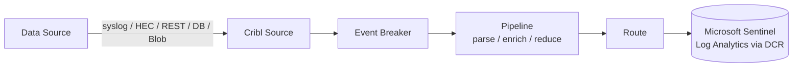

# Cribl Stream Data Onboarding to Microsoft Sentinel


A collection of onboarding runbooks for routing security telemetry through **Cribl Stream** into **Microsoft Sentinel**. Each guide covers the full path a data source takes through the pipeline: **Source → Event Breaker → Pipeline (parsing / enrichment / reduction) → Route → Destination (Microsoft Sentinel)**.

> [!NOTE]
> All environment-specific values in these runbooks — hostnames, tokens, account keys, IP addresses, subscription IDs, service-account names, and workspace identifiers — have been **redacted** and replaced with `<PLACEHOLDER>` style tokens. Substitute your own values before use. Screenshots referenced in these docs have likewise been described rather than embedded, so no sensitive UI state is exposed.

---

## The onboarding pattern

Every source in this repo follows the same five-stage shape. Understanding the pattern once makes each individual guide quick to read.



| Stage | What it does |
|---|---|
| **Source** | The listener or collector that receives/pulls the raw data (Syslog, Splunk HEC, REST Collector, Database Collector, Azure Blob Collector). |
| **Event Breaker** | Splits the incoming stream into discrete events and sets `_time`. |
| **Pipeline** | Parses fields, normalizes to a schema Sentinel expects, enriches (lookups/GeoIP), and reduces volume (Drop/Sampling). |
| **Route** | A filter expression that binds matching events to a pipeline and a destination. `Final: Yes` prevents double-delivery. |
| **Destination** | Microsoft Sentinel, reached via a Data Collection Endpoint (DCE) + Data Collection Rule (DCR) into a Log Analytics workspace. |

---

## Sources covered

| # | Source | Ingest method | Guide |
|---|---|---|---|
| 1 | Cato Networks Firewall | REST Collector (eventsFeed API) | [01-cato-firewall.md](./01-cato-firewall.md) |
| 2 | Azure Blob (Commerce / AKS container logs) | Azure Blob Collector | [02-azure-blob-kubernetes.md](./02-azure-blob-kubernetes.md) |
| 3 | ServiceNow | REST Collector (table API) | [03-servicenow.md](./03-servicenow.md) |
| 4 | Oracle IFS Database | Database Collector | [04-oracle-ifs-database.md](./04-oracle-ifs-database.md) |
| 5 | Zscaler NSS Web / DLP | Splunk HEC Source | [05-zscaler-nss-web-dlp.md](./05-zscaler-nss-web-dlp.md) |

---

## Configuring the Microsoft Sentinel destination (shared step)

Every guide in this repo terminates at the same destination type, so it is documented once here and referenced from each runbook.

Cribl ships a native **Microsoft Sentinel** destination that writes to a Log Analytics workspace through the Azure Monitor **Logs Ingestion API**. It needs four things from the Azure side:

1. An **Entra ID app registration** (service principal) with a client secret.
2. A **Data Collection Endpoint (DCE)**.
3. A **Data Collection Rule (DCR)** that maps incoming fields to the target custom table.
4. The **Monitoring Metrics Publisher** role granted to the app registration on the DCR.

In the Cribl **Microsoft Sentinel** destination, populate:

| Field | Value |
|---|---|
| **Tenant ID** | `<AZURE_TENANT_ID>` |
| **Client ID** | `<APP_REGISTRATION_CLIENT_ID>` |
| **Client secret** | Store under **Manage → Secrets**, reference by name (not inline) |
| **DCE Logs Ingestion URL** | `https://<dce-name>.<region>.ingest.monitor.azure.com` |
| **DCR Immutable ID** | `dcr-<IMMUTABLE_ID>` |
| **Stream name** | `Custom-<TableName>_CL` |

> [!TIP]
> Store the client secret as a Cribl **text secret** (Manage → Secrets) and reference it, rather than pasting it into the destination config. This keeps it encrypted at rest and makes rotation a config-free change.

> [!IMPORTANT]
> Where a source's original design pointed at **Azure Data Explorer (ADX)** as a lake, these runbooks route to **Microsoft Sentinel** instead. Any table name shown as `<Table>_CL` is the Sentinel custom-log table for that source.

---

## Verification (shared step)

After wiring a source, verify in this order — the same sequence applies to every guide:

1. **Live Data / Preview** on the Source → confirm events arrive and `cribl_breaker` is not `fallback`.
2. **Pipeline Preview (Simple)** with captured sample data → confirm parsing/renames did what you expect.
3. **Route with `Final: No` first** → confirm events reach the destination, then set `Final: Yes`.
4. **Confirm in Sentinel** with a KQL spot check:

```kql
<TableName>_CL
| where TimeGenerated > ago(1h)
| take 20
```

---

## Conventions used in these docs

- `<ANGLE_BRACKETS>` = a value you must substitute.
- Ports shown (e.g. `20000`–`20010`) are illustrative of a Cribl.Cloud worker-group allowed range; confirm your own.
- Code blocks are labeled (`bash`, `kql`, `javascript`, `sql`) for syntax highlighting on GitHub.
